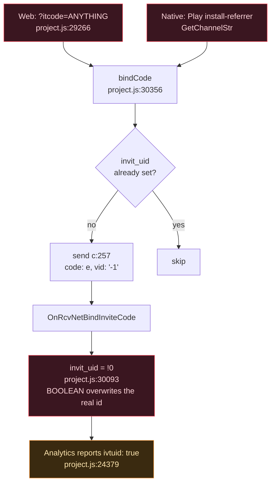
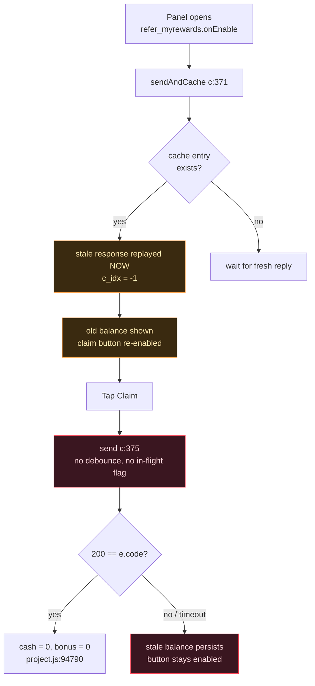
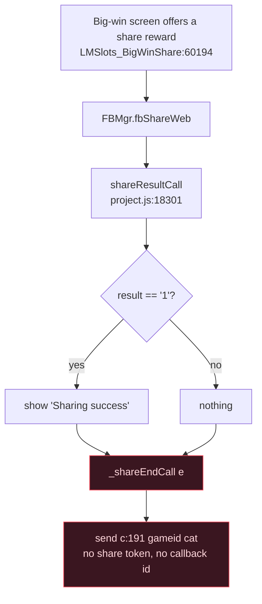
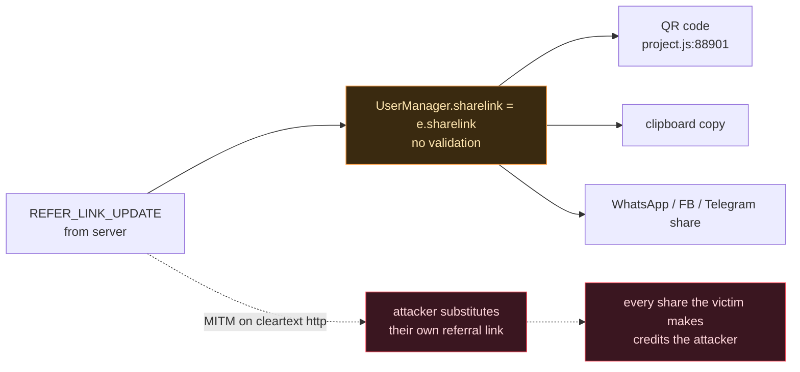
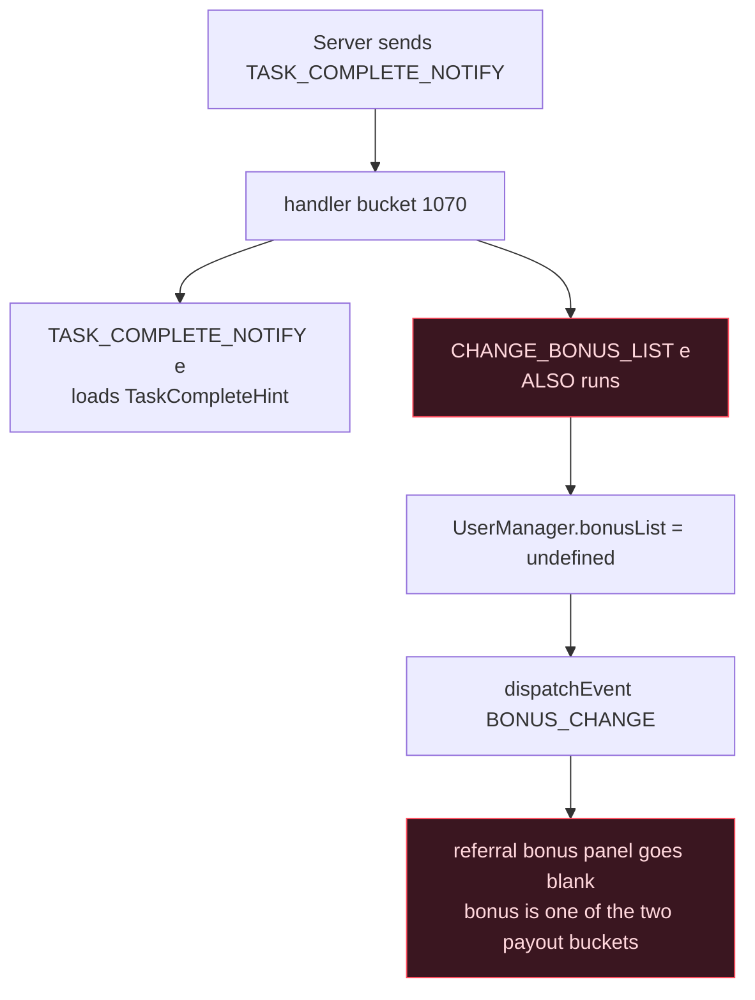
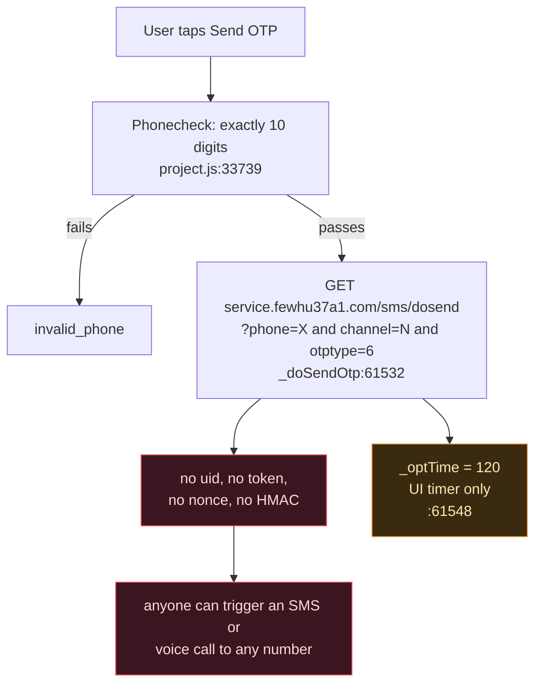
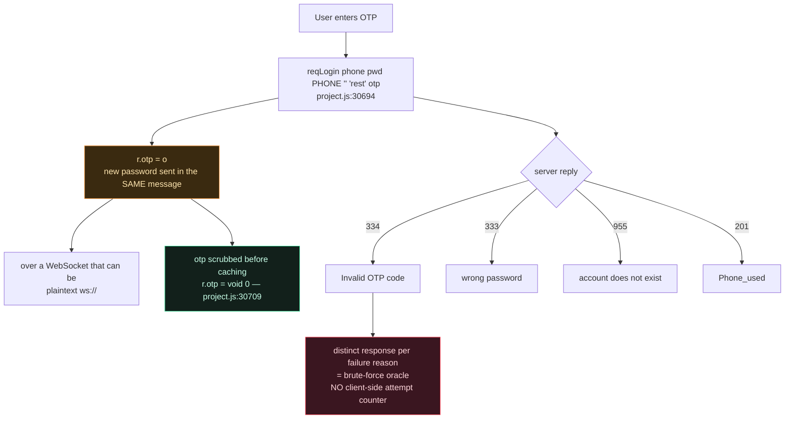
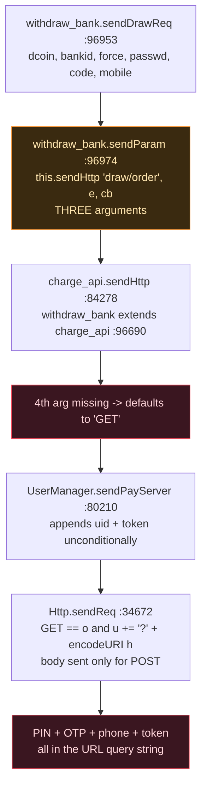
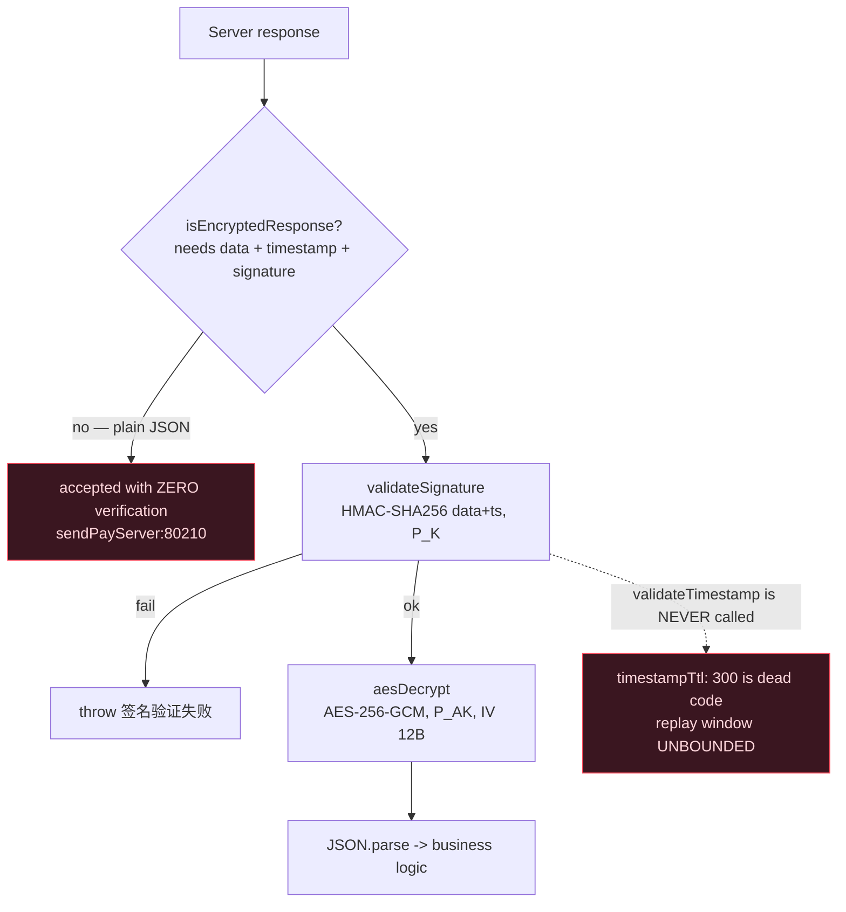
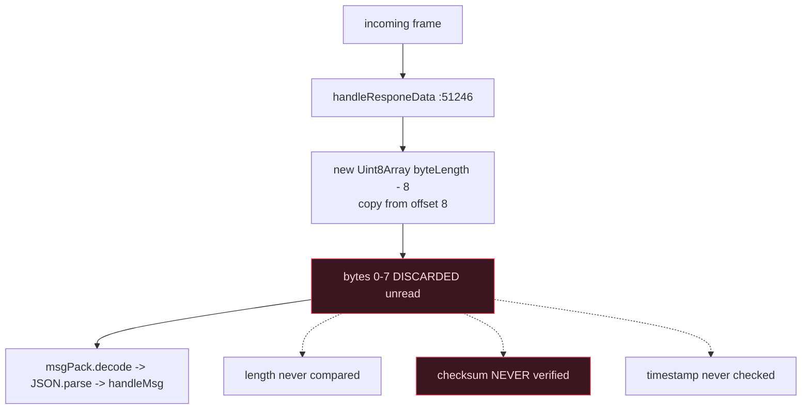

# ShareSlots — Security Flow Map

> **This file renders directly on GitHub** — the diagrams are Mermaid, which GitHub draws
> natively. Open the blob URL and the flows appear; nothing to download, no external service.
>
> There is also an interactive version, [`FLOW.html`](FLOW.html) (7 tabs, clickable findings
> index). GitHub shows `.html` as source code, so download it and open it locally — or view it
> rendered via `https://htmlpreview.github.io/?` + the blob URL.

**Target** `shareslots_YAZGC3JD46R.apk` · `com.shareslots.games.fun` · v1.1.7 (117)
**MD5** `62aa898d77bd8c9a55d0be4316b56282` · Cocos Creator 2.x · 544 modules / 835 scenes

Every claim below is traceable to a line in the decrypted `project.js`, or to a passing
assertion in [`harness/`](harness/).

| | |
|---|---|
| **Critical** | 4 |
| **High** | 13 |
| **Medium** | 13 |
| **Info / verified-good** | 4 |
| **Harness assertions** | 28 / 28 passing |

---

## 1. Refer &amp; Earn

### 1.1 Attribution — how an invite gets credited



Both inputs are attacker-supplied. There is **no server-issued, signed, single-use invite
token** anywhere in the client, and `vid` is hardcoded to `"-1"` so the server gets no
independent device identity to cross-check.

### 1.2 Claiming a reward



**The cache is never invalidated — verified.** `cacheList` has exactly three touch points in
101,768 lines: declaration (`:51028`), the only write (`this.cacheList.push(n)`, `:51515`), and
the read (`:51535`). No TTL, no expiry, no clear, no invalidation on any event.
`cacheIdxList` (`:51524`) grows without bound.

### 1.3 Every claim button in the app is unguarded

`Global.onClick` (`:33139`) is bare `a.on("click", i, n)`. A `Global.delayInteractable(node, 0.5)`
helper exists and none of these use it. **6 of 6 audited, 0 guarded:**

| Module | Sends | Guard |
|---|---|---|
| `refer_myrewards` | `{c: REF_CLAIM_REWARD}` | ❌ none |
| `refer_Leadboard_Claim` | `{c: 378, id}` | ❌ none |
| `yd_rank_Leadboard_Claim` | `{c: 378, id, tag:"claim"}` | ❌ none |
| `PromoCode_Item` | `{c: PROMO_CODE_USE, id}` | ❌ none |
| `return_rewards` | `{c: REQ_RETURN_REWARDS_CLAIM}` | ❌ none |
| `yd_bonus_task` | `{c: EVENT_BIG_TASK_REWARD, taskid}` | ❌ none |

The two leaderboard claims send **different payloads for the same MsgId 378** — one includes
`tag:"claim"`, the other does not.

### 1.4 Share rewards are self-asserted



`_shareEndCall` sits **outside** the success branch, so a failed share still triggers the reward
request. Over an unauthenticated WebSocket an attacker can simply send the frame directly.

### 1.5 Referral-link hijack



### 1.6 Message-ID namespace

638 names over **515** distinct numeric IDs → **117 collisions**. Only 4 have both names
referenced in code: `169`, `270`, `273`, `1070`.

**`1070` is the damaging one.** `CHANGE_BONUS_LIST` and `TASK_COMPLETE_NOTIFY` are both
registered (`:79315`, `:79325`) and `handleMsg` calls *every* handler in the bucket, breaking
only if one returns exactly `1`. Neither does:



Plus **9 dead referral MsgIds** from an abandoned `REQ_REFFERS_*` protocol, now colliding with
`EVENT_FB_INVITE_*`: `254, 255, 256, 259, 261, 262, 267, 430` and `EVENT_FB_SHARE_SUCCESS` (241).

---

## 2. OTP — send and verify



### 2.1 Verification



All five withdrawal-OTP call sites (`:96965`, `:97505`, `:97927`, `:98307`, `:98692`) do only
`if (!n) show("Invalid OTP code")` — that is an emptiness check, not a validation. The payment
PIN *does* have a counter (`_nErrorCnt >= 3`), but it lives on the component instance, so
navigating away clears it.

### 2.2 The finding that makes OTP leakage concrete

```js
// Http.sendReq — the REQUEST log is gated:
Global.localVersion && console.log("#######request url:" + u + " => " + JSON.stringify(t));

// Http.onReadyStateChanged (project.js:34695) — the RESPONSE log is NOT:
if (e.status >= 200 && e.status < 400) {
    console.log("http res(" + e.responseText.length + "): " + e.responseText);
```

**Every HTTP response body is logged with no debug gate.** With `allowBackup="true"` and a
USB-debuggable device, `adb logcat` captures all of it. If the OTP endpoint ever returns the
code in its response body, it lands in logcat in cleartext.

### 2.3 Proven with the app's own code

`harness/otp_attack.js` loads the APK's real `Http` module with a stubbed XHR — **16/16 pass**:

```
http://pay.example.invalid/v1/sms/index?phone=9876543210&channel=0&otptype=4
                                        ^^^^^^^^^^^^^^^ in the URL
   &lang=en&uid=10023456&token=a1b2c3d4e5f60718293a4b5c
                         ^^^^^^^^^^^^^^^^^^^^^^^^^^^^ session token in the URL
```

`encodeURI` is used, **not** `encodeURIComponent`. It does not escape `& = + # ? ; /`, so the
harness proves a value of `9876543210&otptype=9&admin=1` survives as two extra real parameters.
`Phonecheck` blocks this on the OTP paths — but `onClickBinding` gates its phone check on the
server-controlled `UserManager.bind_req_phone`, so when that is false the regex is skipped.

---

## 3. Withdrawal — the most serious finding



The URL the app actually produces, captured by running its own `sendReq`:

```
http://pay.example.invalid/v1/draw/order?dcoin=5000&bankid=77&force=1
   &passwd=482913                     <- the payment PIN
   &code=391042                       <- the SMS OTP
   &mobile=9876543210                 <- the phone number
   &lang=en&uid=10023456
   &token=a1b2c3d4e5f60718293a4b5c    <- the session token
```

URL query strings are the most-logged part of an HTTP request: web-server access logs,
load-balancer logs, any proxy or CDN in the path, and the `Referer` header of anything the page
subsequently loads.

**Scope is wider than withdrawals.** `sendPayServer` defaults to `GET` and appends `t.uid` +
`t.token` (`:80224-80225`) to *every* request — so the session token rides in query strings
across the whole pay API: `user/balance`, `user/banks`, `draw/alltypes`, `draw/drawType`,
`sms/index`.

---

## 4. Encryption



### 4.1 The three layers

| Layer | Scheme | Key material | Strength |
|---|---|---|---|
| Script protection | XXTEA → gzip | `b32a2160-0c63-41` in `.rodata` | **0 bits** |
| Config / localStorage | delta chain + `escape()` | none | **0 bits** |
| HTTP response | AES-256-GCM + HMAC-SHA256 | two static 32-byte strings in the APK | **0 bits** |
| WebSocket | — | — | **none** |
| Payment PIN | — | — | **none** |

### 4.2 What the harness proved — 12/12

| # | Assertion | Result |
|---|---|---|
| 0 | `this.validateTimestamp(` appears **0** times | TTL is dead code → unbounded replay |
| 1 | envelope forged with the recovered APK keys | **accepted**, decrypts correctly |
| 2 | `HMAC("abc",123) === HMAC("abc1",23)` | canonicalisation is ambiguous |
| 3 | plain JSON, no envelope | **passes with zero verification** |
| 4 | identical envelope replayed 1 s later | **accepted** |
| 5a | flipped byte + original signature | HMAC rejects ✓ |
| 5b | flipped byte + **re-signed** with the stolen key | GCM tag rejects ✓ |
| 5c | — | **primitives are sound; the defect is key management** |
| 6 | same forgery with `crypto.subtle` deleted | accepted via the CryptoJS fallback |

### 4.3 XXTEA recovery

```
jsb_set_xxtea_key   exported @ 0x6e74ec
  └─ PLT stub       0x313100   (GOT 0x1530ec8, rela.plt #1974)
      └─ only caller  0x3330c0
           0x3330a8  adrp x1, #0x112c000
           0x3330b0  add  x1, x1, #0xb05      -> .rodata 0x112cb05
.rodata @ 0x112cb05:  Cocos Game\0 b32a2160-0c63-41\0
```

Re-encrypting the decrypted gzip stream reproduces all 9 `.jsc` files **byte-for-byte**. The key
is a truncated UUID (~56 bits of entropy) but that is irrelevant — it is a plaintext string in
`.rodata`. The real problem is the format: XXTEA has **no authentication**, and the plaintext is
gzip, whose first 10 bytes are a fixed header — a free known-plaintext block at a known offset.

---

## 5. WebSocket



**Frame layout:** `[len:2][cksum:2][ts:4][payload:N]`, all big-endian.

`srcSum` covers **only the first 128 bytes** (`t < 128 ? srcSum(e,t) : srcSum(e,128)`), and on
the receive path it is not consulted at all — the checksum is write-only.

**Transport selection depends on whether the host contains a colon:**

| Host form | Scheme | Cert pinning |
|---|---|---|
| `lo.wfvbu98d.com` | `wss://` | Android only |
| `host:port` | **`ws://` plaintext** | none |
| anything, on iOS or web | `wss://` | **none** |

Login token: `md5(timestamp + "hero888")` — a hardcoded 7-char salt.

---

## 6. All findings

### Critical

| # | Area | Finding | Evidence |
|---|---|---|---|
| 1 | Withdrawal | Payment PIN, SMS OTP, phone, uid and session token sent as GET query parameters | `:96974` → `:84278` → `:34672` · harness 16/16 |
| 2 | Encryption | Both static keys ship in the APK → any wallet response can be forged and is accepted | `response-decrypt.js` · harness test 1 |
| 3 | Encryption | Encryption is opt-out — plain JSON accepted with zero verification | `sendPayServer:80210` · test 3 |
| 4 | Referral | All 6 `onClickClaim` handlers have no debounce or in-flight guard | `Global.onClick:33139` |

### High

| # | Area | Finding | Evidence |
|---|---|---|---|
| 5 | Encryption | The 300 s replay TTL is dead code → replay window unbounded | `:95204` vs `:95188` · test 0 |
| 6 | OTP | OTP send is an unauthenticated GET carrying only phone/channel/otptype | `_doSendOtp:61532` |
| 7 | OTP | Every HTTP response body is `console.log`ged with no debug gate | `:34695` |
| 8 | Referral | `sendAndCache` cache is never invalidated | 3 touch points only |
| 9 | Referral | Referral link is server-controlled and feeds the QR code + every share | `:88901` |
| 10 | Referral | Agent Telegram/WhatsApp contacts go straight to `openURL`, no allow-list | `yd_rank_referrals` |
| 11 | Referral | MsgId 1070 collides — a task-complete push wipes the referral bonus pool | `:79315` vs `:79325` |
| 12 | Encryption | Signature canonicalisation ambiguous — `HMAC(data+ts)`, no separator | test 2 |
| 13 | WebSocket | Receive path discards the header without verifying checksum/length/timestamp | `:51246` |
| 14 | WebSocket | A host containing a colon falls back to plaintext `ws://`; pinning is Android-only | `connect:51276` |
| 15 | Encryption | XXTEA key is a plaintext string in `.rodata` | `0x112cb05` |
| 16 | Auth | Login token is `md5(timestamp + "hero888")` | — |
| 17 | Encryption | Delta cipher protecting localStorage tokens uses no key — 0 bits | `Global.compile:32558` |

### Medium

| # | Area | Finding | Evidence |
|---|---|---|---|
| 18 | OTP | No client-side OTP attempt counter; `spcode 334` is a wrong-OTP oracle | `:30831` · 5 call sites |
| 19 | OTP | The only OTP-send rate limit is a 120 s UI timer | `:61548` |
| 20 | OTP | OTP-less login sends empty phone+password, resting on a WhatsApp token | `:29468` |
| 21 | Referral | `invit_uid` overwritten with a boolean, corrupting attribution | `:30093` vs `:29635` |
| 22 | Referral | Share rewards self-asserted — callback fires even when the share failed | `:18301` |
| 23 | Referral | `referid` is a client-chosen user id — potential IDOR | `refer_myreferrals_item` |
| 24 | Referral | `_showRewads` dereferences a null `total`/`today` → TypeError | `refer_myrewards` |
| 25 | Referral | NaN pagination reaches the wire as `{"page":null}` | `refer_myreferrals:121` |
| 26 | Referral | `maskNameStr(n,3,3)` reveals the whole name for ≤6 chars, next to the real uid | `Global.maskNameStr` |
| 27 | Referral | 9 dead referral MsgIds from an abandoned protocol | `MsgIdDef`/`MsgIdConfig` |
| 28 | Encryption | `elliptic` 6.5.2 — CVE-2020-13822 names this exact version | module 82 `package.json` |
| 29 | HTTP | `encodeURI` instead of `encodeURIComponent` leaves `& = #` live in query values | `:34672` · test 3 |
| 30 | Config | `allowBackup`, `usesCleartextTraffic`, `requestLegacyExternalStorage` all true | `AndroidManifest.xml` |

### Info / verified-good

| # | Area | Finding |
|---|---|---|
| 31 | Referral | `onClickCopy` reports success before copying, and copies the text not the link |
| 32 | Referral | `PBPopupInvite`'s 3-invite cap is a localStorage check that **fails open** |
| 33 | Encryption | Both integrity layers verified working — HMAC and GCM tag each reject tampering |
| 34 | Encryption | `aes-gcm-decrypt`'s hand-rolled GHASH is correct, including a constant-time tag compare |

---

## 7. What I could not verify

- **Server-side behaviour:** whether claims are idempotent, whether `referid` is
  authorisation-checked, whether OTP/PIN attempt counters or `sms/index` rate limits are
  enforced server-side, and whether `payapi` is served over `http` or `https` (assigned at
  login from `this.payapi = t.payapi`).
- **Whether the OTP endpoint returns the code in its response body.** I sent no traffic to
  `service.fewhu37a1.com`. The client-side `console.log` is unconditional regardless, so this
  is worth checking in your own server logs.
- Whether the WhatsApp OTP-less token is validated server-side.
- Whether the forged-envelope attack succeeds against a **live** server — I proved the client
  accepts forgeries; I sent no traffic to `ifs.wfvbu98d.com`.
- Runtime behaviour on a device. Everything here is static analysis plus execution of the
  extracted modules in Node 22.

---

## 8. Reproduce

```bash
python3 -m pip install --user --break-system-packages pycryptodome
python3 harness/extract.py work/dec/project.js work/dec/cocos2d-jsb.js

node harness/attack.js        # -> 12 passed, 0 failed
node harness/otp_attack.js    # -> 16 passed, 0 failed
```

See [`harness/README.md`](harness/README.md) for what each assertion proves.
